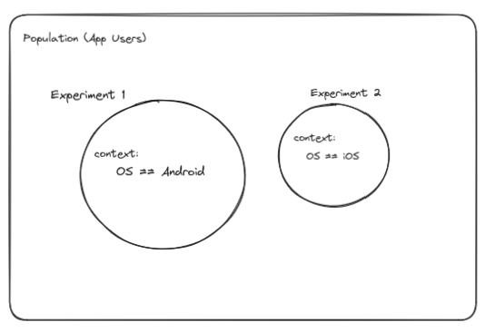

# Experimentation

## Introduction
In a nutshell, **Experimentation** module enables to run A/B/../n testing for your configurations in equi-sized groups/cohorts, it works on top of **Context-Aware-Config** and can also work as a release system for your configuration.

## Concepts

### Experiment
An experiment as name suggest enables you to test and evaluate the behaviour of the system for different values of the same configuration. An experiment can have exactly one **CONTROL** variant and `n` **EXPERIMENTAL** variants, with each variant overriding/changing same set of keys in configuration. An experiment's scope can be controlled by declaring the context, which chalks out the sample set for the experiment from the population.

 
 

### Variant
A variant in an experiment, represent one of the `n` tests. In simple terms, its a collection of key-value pairs, where each key is your already defined **default-config** key, and the value can be any valid new/old configuration value for the key. There are two kinds of variants:
1. **CONTROL**: It conceptually represents the current state of the configuration. 
2. **EXPERIMENTAL**: The experimental variant lets you define the newer value for the **default-config** keys.

 
 

### Experiment's Traffic Percentage
This defines the traffic size for each variant of the experiment, for instance if traffic percentage is `13%` and there are `4` variants in the experiment, this makes each variant of the experiment receive `13%` of the entire traffic and in entirety `13 * 4 = 52%` of the total traffic. 
